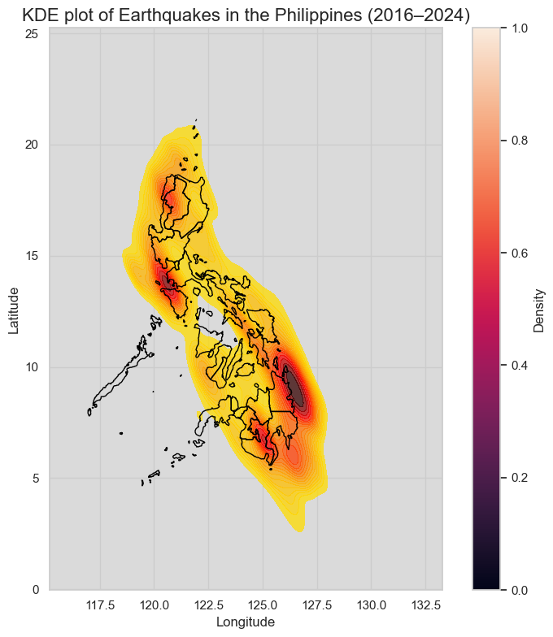

# **Philippines Earthquake Clustering & Hotspots**

In this project, analysis is done on the magnitude and epicenter locations of earthquakes in the Philippines from 2016 to 2024. Data is provided by **PHIVOLCS** and other sources, and will be used for a **Machine Learning system** to detect and visualize seismic hotspots across the Philippine archipelago.

#### **Data Source**

[1] BwandoWando. (2024). Philippine Earthquakes (from PHIVOLCS) [Data set]. Kaggle. https://doi.org/10.34740/KAGGLE/DS/5555087  
[2] GIS Data / SimpleMaps: https://simplemaps.com/gis/country/ph  
[3] PHIVOLCS Earthquake Bulletins: https://earthquake.phivolcs.dost.gov.ph/  
[4] Shapefile of Philippine Fault System (FOI): https://www.foi.gov.ph/requests/shapefile-of-philippine-fault-system/

**PHIVOLCS** Earthquake Bulletins of latest seismic events in the Philippines are listed below. The event parameters (hypocenter, time and magnitude) are determined using incoming data from the 

Philippine Seismic Network. Philippine Standard Time (PST) is eight hours ahead of Coordinated Universal Time (UTC). (PST = UTC + 8H) UTC is the time standard for which the world regulates clocks and time. Earthquakes in this list with their date and time in blue have reported and recorded intensities. Intensity ratings are based on the PHIVOLCS Earthquake Intensity Scale.

#### **Geomatics Services Request**

The Geomatics and Hazard Assessment Services Section (GeomHASS) of the Geology, Geophysics R&D Division produces and distributes processed Geographic Information System (GIS)- and Remote Sensing (RS)- related information to PHIVOLCS stakeholders.

### **Example Figures**

Below are some representative figures from the project:

<table>
  <tr>
    <td></td>
    <td rowspan="2"></td>
  </tr>
  <tr>
    <td></td>
  </tr>
</table>

|  |  |
|-----------------------------------------------------------|----------------------------------|
|                    |                                  |

### **Setup**
1. Clone the repository
2. Create a virtual environment
3. Activate the virtual environment: `env\Scripts\activate`
4. `pip install -r requirements.txt`
5. (Optional) `jupyter notebook` or `jupyter lab`

### **How to Run**
- To run exploratory data analysis (EDA): `notebooks/01_data_exploration.ipynb`
- To run clustering: `notebooks/02_clustering.ipynb` 
